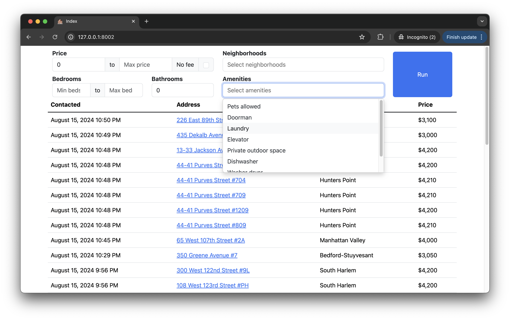

# StreetEasy Monitor
Python script that checks StreetEasy for new rentals matching search criteria and automatically messages new matches.

Includes a Flask application that provides a messaging interface and displays contacted listings, plus optional helper scripts for setting up a cron job to run the script continuously.

### Features
- Uses a [Requests](https://pypi.org/project/requests/) Session with [fake-useragent](https://pypi.org/project/fake-useragent/) to bypass request blocking
- [BeautifulSoup4](https://pypi.org/project/beautifulsoup4/) for HTML parsing
- SQLite for database operations
- [environs](https://pypi.org/project/environs/) for environment variable parsing
- Simple web app implemented with [Flask](https://flask.palletsprojects.com/en/3.0.x/), [Flask-WTF](https://flask-wtf.readthedocs.io/en/1.2.x/), and [Choices.js](https://github.com/Choices-js/Choices)
- Integration with [Paddaddy](https://paddaddy.app/) for added rental info
- Helper scripts for cron job management

## Table of Contents
- [Usage](#Usage)  
- [Installation](#Installation)
- [Configuration](#Configuration)  
- [Important Notes](#Important-Notes)

## Usage

### Command line execution
Run the script using the values in the `defaults` dictionary found in `src/streeteasymonitor/config.py` for the search parameters.
```bash
(.venv) $ python main.py
```

### Run Flask application 
The application will run on port 8002 by default (can be changed in `app/app.py`).
```bash
(.venv) $ python -m app.app
```
The application consists of:
- A form that can be used to check for listings based on specified criteria
- A table listing every rental that has been contacted so far, sorted by most recent

When possible, listings link to their corresponding page on [Paddaddy](https://paddaddy.app/), and otherwise link to the original page on StreetEasy.



### (Optional) Create cron job
Setting up a cron job is the most straightforward way to run the script continuously, but it can be difficult to configure correctly. A collection of bash scripts are included to help streamline the process.

Navigate to the cron folder and make all scripts executable
```bash
(.venv) $ cd cron
(.venv) $ chmod +x `ls *.sh`
```

Create cron job

*Note: if using a virtual environment, it must be activated for the script to select the correct Python path.*
```bash
(.venv) $ ./create_cron.sh
```

Start the cron job
```bash
(.venv) $ ./start_cron.sh
```

Stop the cron job
```bash
(.venv) $ ./stop_cron.sh
```

## Installation
### Clone project
```bash
$ git clone https://github.com/joeschermer/streeteasy-monitor.git
$ cd streeteasy-monitor
````
### (Recommended) Install Python and set up virtual environment using [pyenv](https://github.com/pyenv/)  
1. Install Python 3.12.3  
```bash
$ pyenv install 3.12.3
```
2. Create virtual environment
```bash
$ pyenv virtualenv 3.12.3 .venv
```
3. Activate virtual environment
```bash
$ pyenv local .venv
```

### Install requirements
```bash
(.venv) $ pip install -r requirements.txt
```

## Configuration

### Add message and contact info

Edit the `.env` file to include your desired message, along with your phone number, email, and name. A placeholder file with placeholder values is included in the root directory. All fields are required.
```
MESSAGE=[YOUR MESSAGE]
PHONE=[YOUR PHONE NUMBER]
EMAIL=[YOUR EMAIL ADDRESS]
NAME=[YOUR NAME]
```
When the script runs, any matching listings will be sent the above information, and an automated email from StreetEasy will be sent to the address you provided indicating that the message has been sent.

*Note: this information is not visible or accessible anywhere other than your local `.env` file.*

### Configure default search parameters and optional filters
If you choose to run the script by itself or in a cron job, edit the `defaults` dictionary found in `src/streeteasymonitor/config.py` according to your preferences. When running the script using the Flask application, your form inputs override the defaults defined here.

Example:
>
> ```python
> defaults = {
>    'min_price': 1000,
>    'max_price': 4500,
>    'min_beds': 1,
>    'max_beds': 2,
>    'areas': [
>        'Bedford-Stuyvesant',
>        'Carroll Gardens',
>        'Upper East Side',
>    ],
>    'amenities': [
>        'pets',
>    ],
>    'no_fee': True,
>}
>```
>In this example, the script will check for rentals priced between $1,000 and $4,500, with 1-2 bedrooms, in the neighborhoods of Bedford-Stuyvesant, Carroll Gardens, and the Upper East Side that allow pets and have no fee.

There is also a `filters` dictionary, which defines substrings for filtering results not otherwise captured by StreetEasy (e.g. addresses on specific streets, URLs for "featured" listings which include the substring `'?featured=1'`).

Example:
>
> ```python
> filters = {
>    'url': [
>        '?featured=1',
>        '?infeed=1',
>    ],
>    'address': [
>        'Fulton',
>        'Atlantic',
>        'Herkimer',
>    ],
>    'neighborhood': [
>        'New Development',
>        'Ocean Hill',
>    ],
>}
>```
> Here, "featured" listings will be excluded, and so will any rentals with addresses on Fulton, Atlantic, or Herkimer, or in the Ocean Hill sub-neighborhood.

### Configure cron helper scripts for script scheduling
The `cron` directory contains the following files, which can be configured according to your preferences.
- `create_cron.sh`: Saves a cron command to `cron.dat`. The default cron job will run `main.py` every 8 minutes, but can be changed by reassigning `CRON_SCHEDULE`. Refer to [cron.help](https://cron.help/) for schedule formatting.
- `start_cron.sh`: Starts the cron job from `cron.dat`. The job will log stdout/stderr to `cron.log` by default. *(Note: this will overwrite any active cron jobs)*
- `stop_cron.sh`: Stops any active cron job and saves to `cron.dat`.

## Important Notes
Whenever you send a message on StreetEasy, you will receive an automated email at the address you provide indicating that the listing has been contacted. You will then continue to receive automated messages about any updates to the listing (e.g. price changes, rental status). This means that if you run the script repeatedly, you will have a lot of emails to sort through, so you might want to create a new email address if you don't want to clog your inbox.

This is a blunt tool that casts a wide net by design and there may be many listings you contact that aren't interesting to you. You might also annoy brokers who represent multiple listings if you inadvertently send them the same message over and over again. Try to be as specific as possible with your search criteria to avoid these issues.

## Todo
- [x] Add more filtering options (no fee, pets, amenities, etc.)
- [ ] Add no fee and amenities options in Flask
- [ ] Add form fields for name, email, message, and phone number
- [ ] Implement dynamic form submission
- [ ] Persist form fields
- [ ] Add more methods for running continuously (APScheduler?)
- [ ] Add pagination for results table
- [ ] Add alert messages
- [ ] Document all classes
- [ ] Build tests


## Disclaimer
Users of this software are solely responsible for ensuring their use complies with StreetEasy's Terms of Service and all applicable laws and regulations. This tool is intended for personal, non-commercial use only. The authors do not endorse or encourage any use of this software that may violate StreetEasy's policies or any third-party rights.

Use of this software is at your own risk. The authors disclaim any responsibility for any misuse or any consequences that may arise from the use of this software.